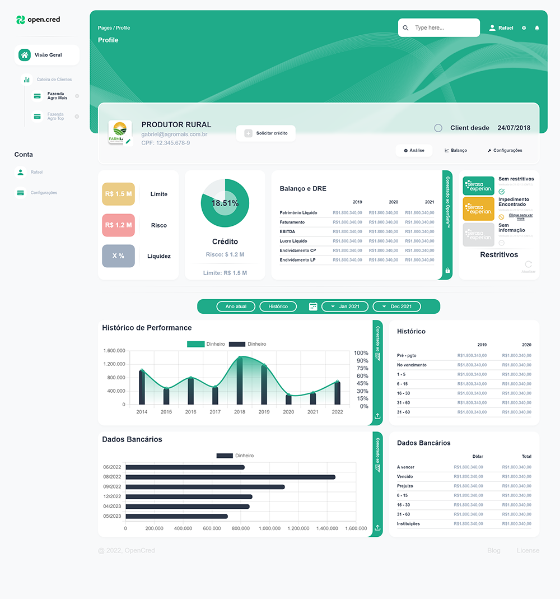
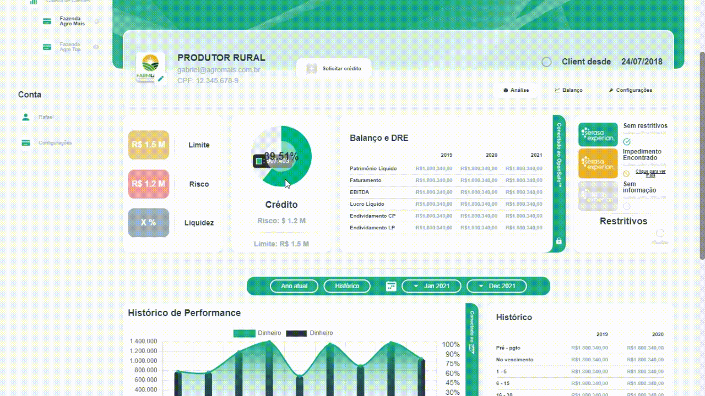

# OpenCred
Site feito para entrevista técnica com a **OpenCred**.
Link da aplicação: https://open-cred-demo.vercel.app/

## Desktop:

## Gráficos Dinâmicos
Clique em cima de qualquer gráfico para mudar os valores

## Tecnologias
Este projeto foi desenvolvido com as seguintes tecnologias:
 - [React](https://reactjs.org/)
 - [Typescript](https://www.typescriptlang.org/)
 - [Styled-components](https://styled-components.com/)
 - [React-icons](https://react-icons.github.io/react-icons/)
 - [Chart.js](https://www.chartjs.org/docs/latest/)
 - [React-chatjs-2](https://react-chartjs-2.js.org/)
